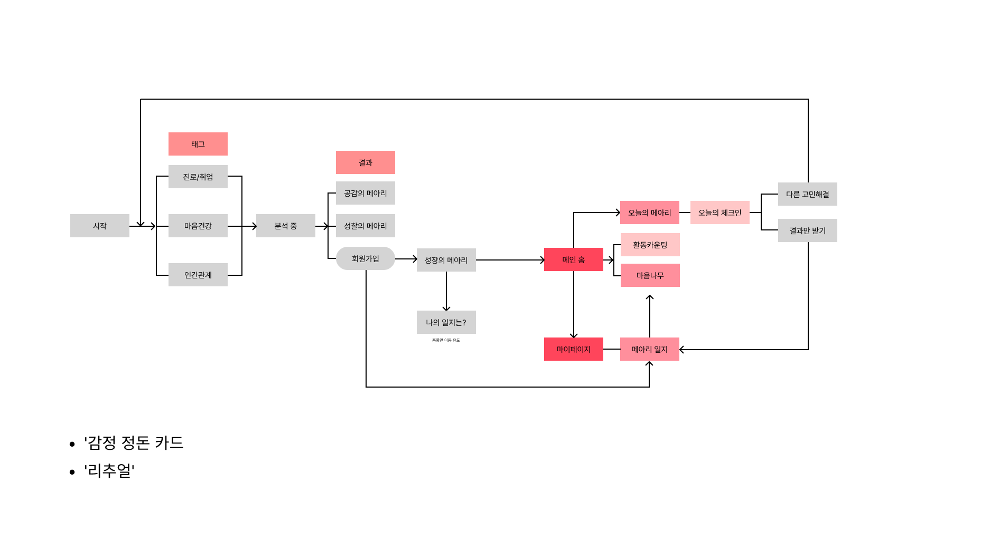
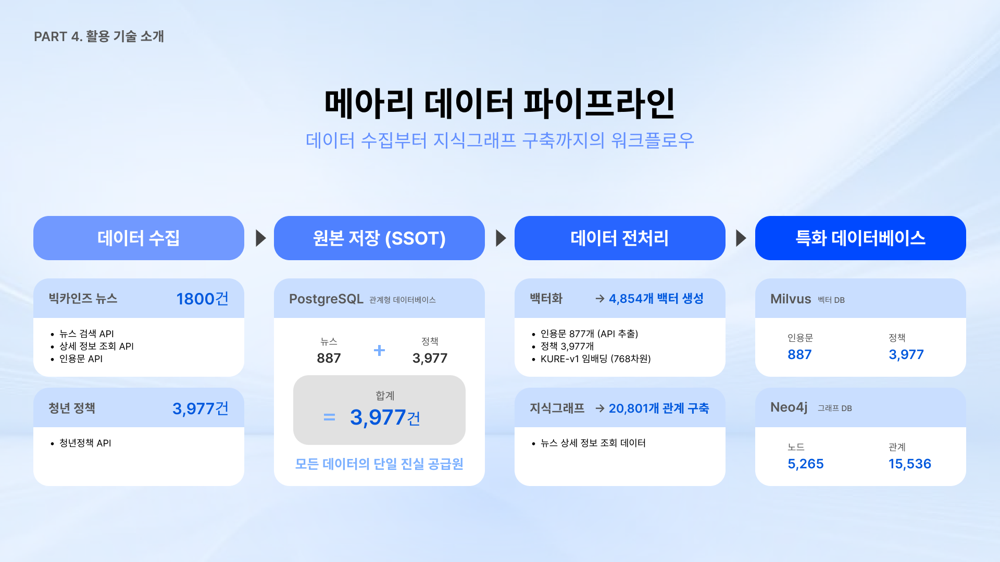

# 메아리(Meari): 은둔·고립 청년을 위한 AI 심리회복 서비스
뉴스 빅데이터 속 '인과관계'를 분석하여, 단순 공감을 넘어 사회 구조적 원인과 해결책을 제시하는 Hybrid RAG 기반 AI 서비스

## 목차
1. [서비스 아키텍처](#서비스-아키텍처)
2. [핵심 기능 구현](#핵심-기능-구현)
3. [기술적 도전과 해결 과정](#기술적-도전과-해결-과정)
4. [기술 스택](#기술-스택)

## 서비스 아키텍처

Hybrid RAG & Multi-Agent System을 기반으로 Vector DB의 의미 검색과 Graph DB의 관계 추론을 결합한 시스템입니다. 6개의 전문 AI 에이전트가 협업하여 공감-성찰-성장의 3단계 심리회복 과정과 지속적인 리추얼 관리를 제공합니다.

## 핵심 기능 구현

### 1. 초기 세션: 태그 선택 & 마음 진단
- **태그 시스템**: 사용자의 현재 고민 영역을 8개 카테고리로 분류 (진로/취업, 인간관계, 번아웃 등)
- **마음 진단**: 선택된 태그 기반으로 현재 감정 상태와 문제 맥락을 분석
- **AI 에이전트**: 진단 에이전트가 후속 카드 생성을 위한 기초 데이터 수집

### 2. 공감 카드 - "오늘의 메아리"
**목적**: 사용자의 감정에 대한 깊이 있는 공감과 정서적 지지

**구현 방식**:
- **감정 분석 에이전트**: 사용자 입력 텍스트에서 감정 상태와 강도를 정밀 분석
- **Vector RAG**: Milvus DB에서 감정적으로 유사한 뉴스 데이터를 검색
- **공감 메시지 생성**: LLM이 검색된 데이터를 바탕으로 위로와 공감의 개인화된 메시지 작성

**데이터**: 뉴스에서 추출한 877개의 감정적 인용문 및 공감 요소

### 3. 성찰 카드 - "사회적 맥락 재해석"  
**목적**: 개인 문제를 사회 구조적 관점에서 재해석하여 자기 책임감 완화

**구현 방식**:
- **성찰 에이전트**: 사용자 문제와 연관된 사회적 원인들을 식별
- **Graph RAG**: Neo4j에서 원인-문제-해결책의 인과관계 체인을 Cypher 쿼리로 검색
- **관점 전환**: "개인 탓이 아닌 사회 구조적 문제"라는 새로운 시각 제시

**데이터**: BigKinds API로 수집한 900개 뉴스의 인과관계 그래프

### 4. 성장 콘텐츠 - "실질적 해결책"
**목적**: 문제 해결을 위한 구체적이고 실행 가능한 방안 제시

**3가지 콘텐츠 타입**:
- **정보(Information)**: 문제 해결에 도움되는 전문 지식과 가이드
- **경험(Experience)**: 유사한 상황을 극복한 실제 사례와 경험담  
- **지원(Support)**: 청년 정책 DB(3,977개)에서 매칭된 맞춤형 지원 프로그램

**구현 방식**:
- **Multi-Modal RAG**: Vector + Graph DB를 모두 활용한 통합 검색
- **정책 매칭 에이전트**: 사용자 상황에 최적화된 정부/지자체 지원책 추천
- **콘텐츠 큐레이션**: 3가지 타입의 콘텐츠를 균형있게 조합하여 제공

### 5. 리추얼 시스템 - "지속적 관리"
**목적**: 일상적인 감정 기록과 지속적인 심리 상태 모니터링

**구현 기능**:
- **감정 정도 기록**: 일일 감정 상태를 1-10 스케일로 기록
- **간단 리추얼**: 하루 3분 내외의 간단한 성찰 활동
- **패턴 분석**: AI가 감정 변화 패턴을 분석하여 맞춤형 피드백 제공
- **마음나무 성장**: 28일 리추얼 완성 시 시각적 성취감 제공

### 6. 대시보드 - "통합 현황 관리"
**목적**: 전체 심리회복 과정의 현황과 성과를 한눈에 파악

**주요 기능**:
- **다른 고민영역**: 이전에 다뤘던 다른 주제들의 히스토리 관리
- **결과관 받기**: 완료된 세션들의 성과와 개선사항 요약
- **월별 캘린더**: 리추얼 수행 현황과 감정 변화 트렌드 시각화
- **성장 지표**: 전반적인 심리 회복 진전도를 수치화하여 표시

### 7. 페르소나 시스템 - "개인화 AI"
**목적**: 사용자별 맞춤형 AI 어시스턴트 생성

**구현 방식**:
- **아이메이지**: 사용자와의 상호작용을 통해 개인화된 AI 캐릭터 생성
- **대화 기억**: 이전 세션들의 맥락을 기억하여 연속성 있는 상담 제공
- **스타일 적응**: 사용자의 선호하는 소통 방식에 맞춰 톤앤매너 조정

## 기술적 도전과 해결 과정 (Technical Deep Dive)

### [도전 1] Graph RAG 도입: 검색 속도 5배 향상 및 맥락 보존
**문제**: 초기 ReAct 패턴의 멀티 에이전트 방식은 순차적 Vector 검색으로 검색 Latency가 10초 이상 소요되었고, 에이전트 간 정보 전달 과정에서 원본 뉴스의 핵심 맥락이 손실되었습니다.
**해결**: 900개의 뉴스를 Neo4j 지식그래프로 사전 구조화했습니다. 한 번의 Cypher 쿼리로 '원인-문제-해결책'의 전체 인과 체인을 조회하도록 설계하여 검색 Latency를 2초로 단축하고, 정보 손실 문제를 원천적으로 해결했습니다.

### [도전 2] 자가 복구 에이전트: LLM의 한계 극복 (쿼리 성공률 64% → 97%)
**문제**: Text-to-Cypher 에이전트의 초기 성공률이 **64%**에 불과하여 Graph RAG 시스템 전체의 안정성을 심각하게 저해하는 요인이었습니다.

**해결**: 쿼리 실행 실패 시, 에러 메시지와 DB 스키마 정보를 LLM에게 다시 전달하여 스스로 쿼리를 수정하게 하는 **'자가 복구(Self-Correction) 메커니즘'**을 구현하여 쿼리 성공률을 97%까지 끌어올렸습니다.

### [도전 3] 프롬프트 모듈화: AI 시스템의 유지보수성 및 확장성 확보
**문제**: 6개 전문 Agent의 프롬프트가 각기 다른 소스코드 파일에 흩어져 있어 일관성 유지가 어렵고, 버전 관리가 비효율적이었습니다.

**해결**: 모든 프롬프트를 중앙에서 관리하는 PromptManager를 설계하고, 도메인별 템플릿을 모듈화하여 프롬프트의 재사용성을 높이고 버전 관리를 체계화했습니다.

### [도전 4] 자동화된 데이터 파이프라인: End-to-End 시스템 구현
**문제**: 뉴스 데이터를 수동으로 수집하고 전처리하는 과정은 재현성이 낮고 비효율적이었습니다.

**해결**: BigKinds API를 통해 데이터를 수집, PostgreSQL에 원본(SSOT)을 저장한 뒤, Vector DB(Milvus)와 Graph DB(Neo4j)로 자동 적재하는 End-to-End 데이터 파이프라인을 구축했습니다.

## 기술 스택

**Framework**: FastAPI

**AI/LLM**: Google Gemini, LangChain, LangGraph

**Database**: PostgreSQL + SQLAlchemy

**Vector DB**: Milvus (Zilliz Cloud)

**Graph DB**: Neo4j (Aura Cloud)

**Embedding**: KURE-v1 (Korean Language Understanding)

**Python**: 3.12 (Docker) / 3.11+ (Local)

**Infrastructure**: AWS EC2, Docker, Docker Compose, Nginx
